# Write Up:
## Scenario 1: Sensor noise
The simulator will generate two log files with GPS and IMU measurements. The task is to process data from these files and calculate the standard deviation(sigma).
In log_data folder i moved the generated files Graph1.txt, Graph2.txt then i used ```std_calc.py``` to calculate the
sigma for both paramter and here is the calculated values

sigma(Quad.GPS.X) = 0.71077

sigma(Quad.IMU.AX) = 0.4892

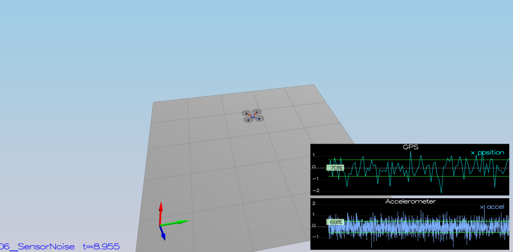

Scenario passed the test, below the standard output:
```
PASS: ABS(Quad.GPS.X-Quad.Pos.X) was less than MeasuredStdDev_GPSPosXY for 70% of the time
PASS: ABS(Quad.IMU.AX-0.000000) was less than MeasuredStdDev_AccelXY for 68% of the time
```

## Scenario 2: Attitude Estimation
In this scenario need to include IMU measurements to the result state. 

From the Estimation for Quadrotors documents in equation (43) the predicted quaternion dq using the IMU gyro angular rates in 
the body frame, and the rotational matrix qt defined by the quadrotor state for the euler angles expresed in quaternions.

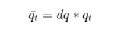

Where the predicted Roll, Pitch, and Yaw resulting from integration method as provided in eq (44) and (45):

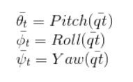

Then the non-linear complementery filter can be updated.

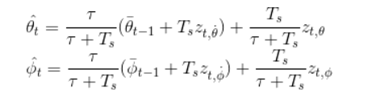

This is require to implement a better integration method that uses the current attitude estimate (rollEst, pitchEst and ekfState(6)) to integrate the body rates into new Euler angles. 
I've used class `Quaternion<float>` with handy methods `FromEuler123_RPY` and `IntegrateBodyRate`.


The implementation of `UpdateFromIMU` can be found in [line 107](src/QuadEstimatorEKF.cpp#L107) in `QuadEstimatorEKF.cpp`.

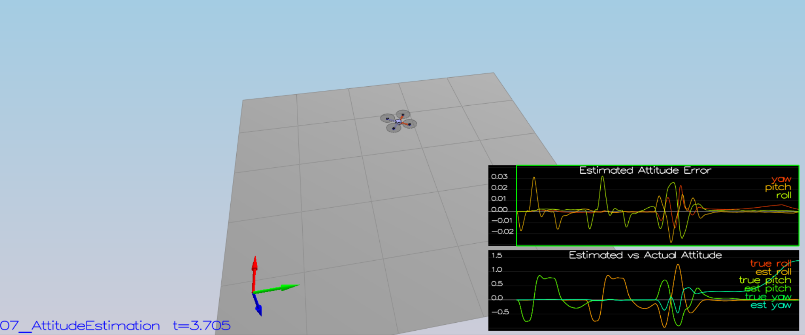
```
PASS: ABS(Quad.Est.E.MaxEuler) was less than 0.100000 for at least 3.000000 seconds
```

## Scenario 3: Prediction Step
The task consist of two parts: implement the prediction step for the EKF and update the covariance matrix and finish the EKF state

1. The g function(The state transition) that calculate the mean from prediction model, which take the readings from gyroscope, accelerometer, rotation matrix R_gb matrix ,previous estimated roll and previous estimated pitch in equation(48),(49) as follows:


The g function is impelemented in `gFun` can be found in [line 494](src/QuadEstimatorEKF.cpp#L494) in `QuadEstimatorEKF.cpp`.

2. The g prime function(The derivative state transition[jacobians]) that calculate the G matrix to calculate the covriance matrix P. Which take the readings from gyroscope, accelerometer, rotation matrix R_gb matrix ,previous estimated roll and previous estimated pitch in equation(51),(52) as follows:

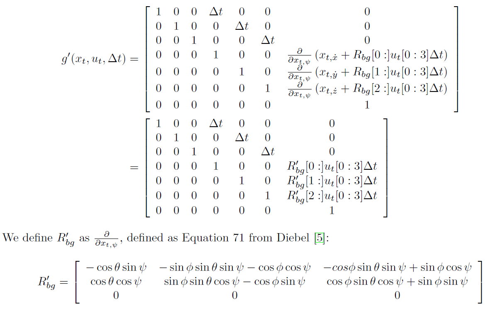

The g prime function is impelemented in `g_prime` can be found in [line 536](src/QuadEstimatorEKF.cpp#L536) in `QuadEstimatorEKF.cpp`.

3. From Algorithm 2 the predict function shall implemented as follows:

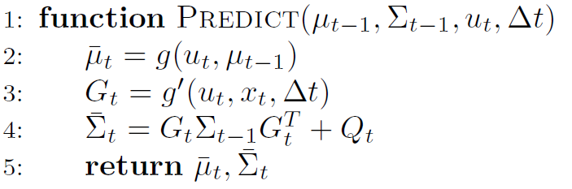

The predict function is impelemented in `Predict` can be found in [line 208](src/QuadEstimatorEKF.cpp#L208) in `QuadEstimatorEKF.cpp`.


Below the screenshot after implementing the first part
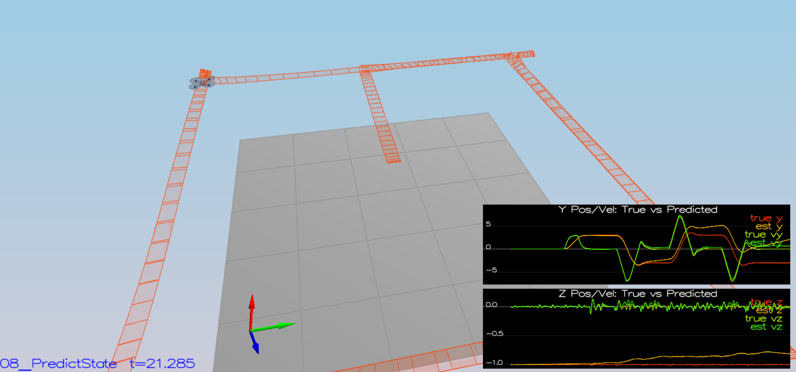


Here is a result screenshot after tuning `QPosXYStd`, `QVelXYStd` process parameters in QuadEstimatorEKF.txt
We can see how sigma growing over time due to the prediction step.
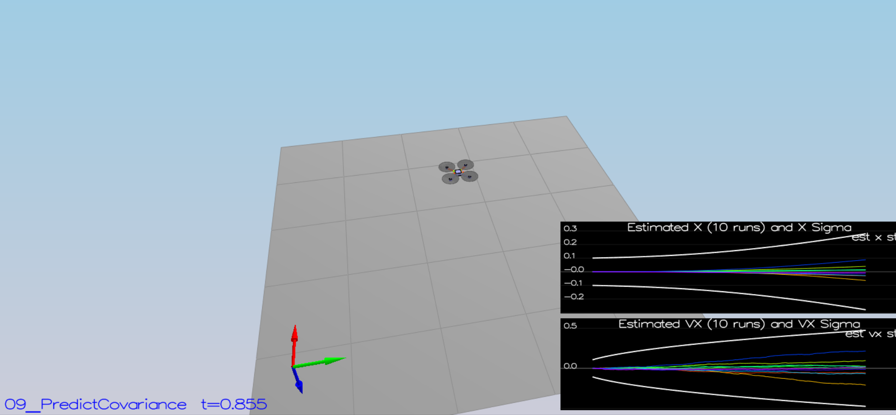

## Scenario 4: Magnetometer Update
Now we need to use the magnetometer to improve our filter's performance in estimating the vehicle's heading.

The magnetometer update shall be updated as follows:
1.Prepare the senosr model (measurement and predicted measurements)
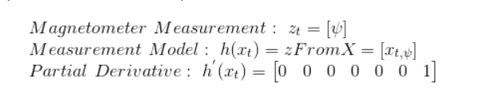

2.Perform Update step using previous sensor model
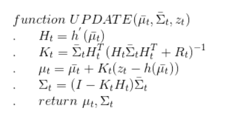

The update  function for magnometer is impelemented in `UpdateFromMag` can be found in [line 326](src/QuadEstimatorEKF.cpp#362) in `QuadEstimatorEKF.cpp`.

And the generic update can be found in `kalmanFilter.h` in function `update` [line 110](src/kalmanFilter.h#110) and the `CalculateKalmanGain` function can be found in the same file [line 80](src/kalmanFilter.h#80)

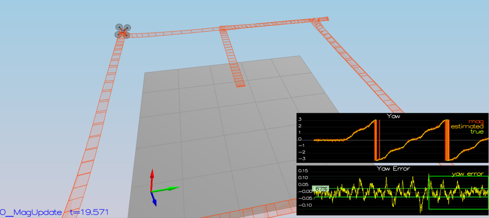
```
PASS: ABS(Quad.Est.E.Yaw) was less than 0.120000 for at least 10.000000 seconds
PASS: ABS(Quad.Est.E.Yaw-0.000000) was less than Quad.Est.S.Yaw for 67% of the time
```

## Scenario 5: Closed Loop + GPS Update 
The estimator should correctly incorporate the GPS information to update the current state estimate.

Similarly with step 4, GPS update requires to pass the proper parameters to the EKF’s Update. After that commenting control params `#SimIMU.AccelStd = 0,0,0 #SimIMU.GyroStd = 0,0,0` in the file `config/11_GPSUpdate.txt`

The GPS update shall be updated as follows:
1.Prepare the senosr model (measurement and predicted measurements)
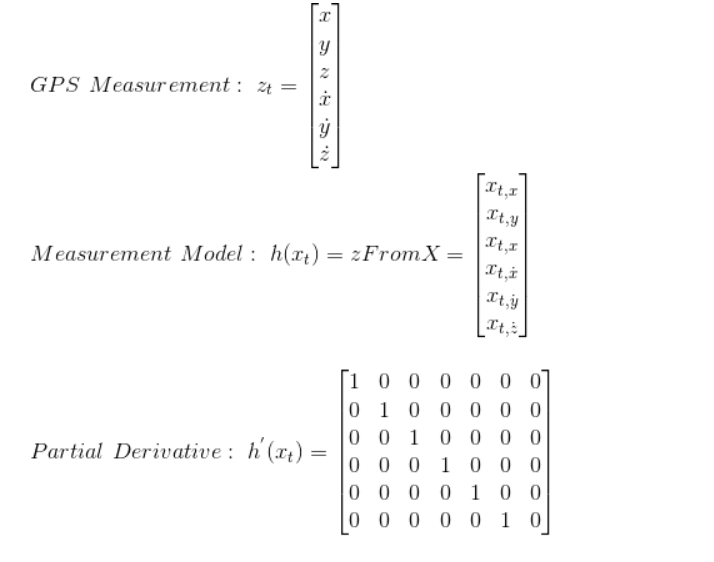

2.Perform Update step using previous sensor model


The update  function for magnometer is impelemented in`UpdateFromGPS` can be found in [line 268](src/QuadEstimatorEKF.cpp#268) in `QuadEstimatorEKF.cpp`.

And the generic update can be found in `kalmanFilter.h` in function `update` [line 110](src/kalmanFilter.h#110) and the `CalculateKalmanGain` function can be found in the same file [line 80](src/kalmanFilter.h#80)

3. Replace `QuadController.cpp` with the controller you impelemented in  last project and replace `QuadControlParams.txt` with the control parameters of last project.

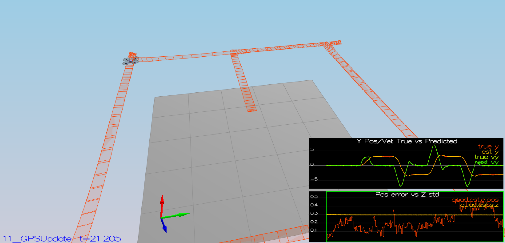
```
PASS: ABS(Quad.Est.E.Pos) was less than 1.000000 for at least 20.000000 seconds
```